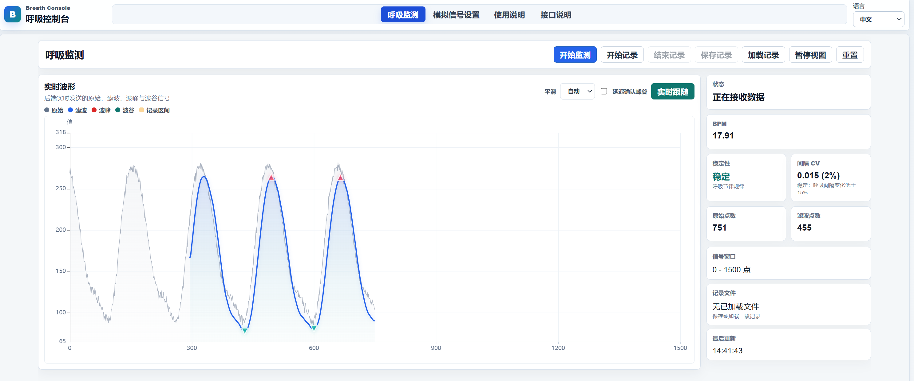
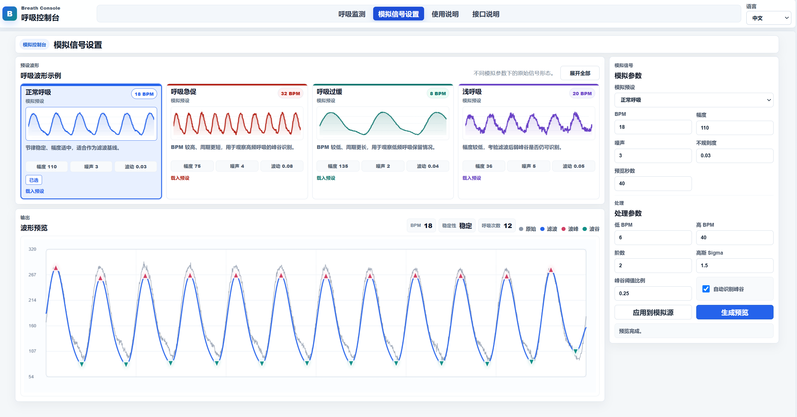
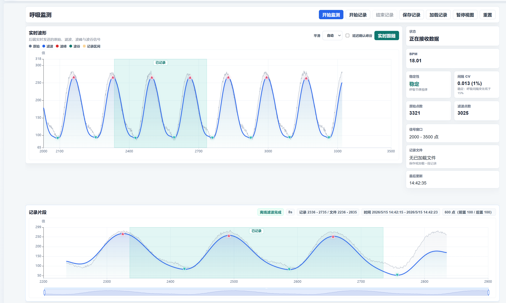
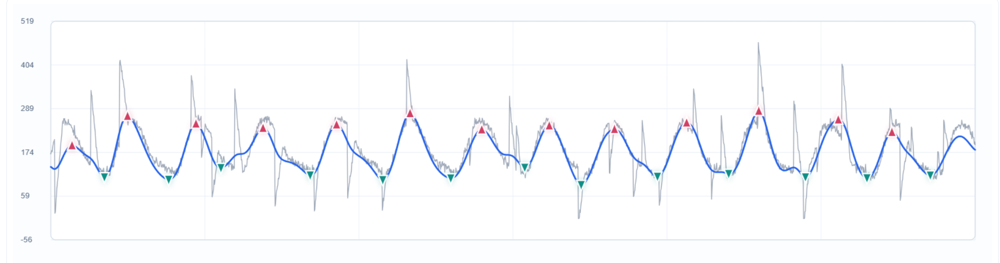
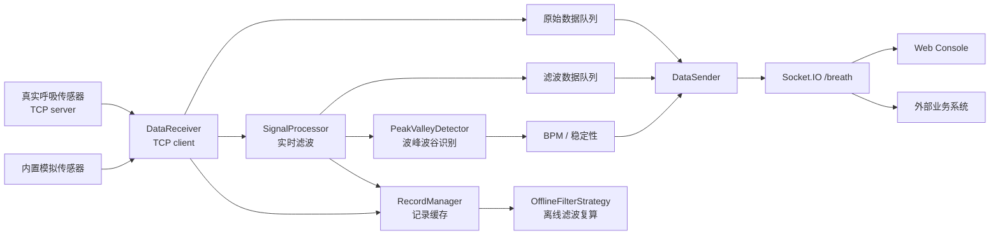

# RespiraScope

RespiraScope 是一个呼吸信号采集、滤波、实时展示和记录分析工具。它支持真实 TCP 呼吸传感器，也内置了模拟呼吸信号，适合用于设备联调、算法验证、呼吸波形处理学习和前端可视化演示。

> 本项目用于工程验证、算法学习和设备调试，不作为医疗诊断、治疗决策或临床监护依据。

## 功能特性

- TCP 呼吸传感器数据接入。
- 内置模拟呼吸信号，支持多种呼吸状态场景。
- 实时滤波、离线滤波复算和自适应滤波参数。
- 波峰、波谷识别，以及 BPM 和呼吸稳定性计算。
- Socket.IO 实时推送原始数据、滤波数据、峰谷事件和指标。
- Web Console 单页入口，包含 Monitor、模拟信号设置、使用指南和接口文档。
- Record Start / End 记录区间，支持 start 前和 end 后辅助数据。
- uv 管理依赖和启动流程，支持 Windows exe 打包。

## 界面预览

### 呼吸监测

Breath Monitor 面向实际使用者，展示后端实时推送的原始呼吸波形、滤波波形、波峰波谷、BPM 和呼吸稳定性。



### 模拟信号设置

模拟信号设置页用于后端调试和滤波观察，可以切换多种模拟呼吸状态，调整模拟参数和处理参数，并预览原始波形、滤波结果、波峰和波谷。



### 记录分析

记录片段用于查看 Record Start 到 Record End 期间的原始数据、滤波数据、波峰波谷，并支持带前后辅助点的记录文件。



### 异常信号处理

异常信号处理用于观察咳嗽、突发干扰和不规则呼吸片段对实时波形、滤波结果、波峰波谷识别和 BPM 指标的影响，便于调试算法鲁棒性。


咳嗽伪影场景展示了短时强扰动下的波形变化和滤波表现，可用于验证异常片段识别、回看和记录复盘效果。



## 软件结构

RespiraScope 由后端采集处理服务、统一 Web Console、模拟传感器和外部配置文件组成。



核心模块：

| 层级 | 说明 |
| --- | --- |
| 传感器输入 | 后端作为 TCP client 连接真实呼吸设备；也可以启用内置模拟传感器 |
| 实时处理 | `DataReceiver` 接收原始点，`SignalProcessor` 实时滤波，`PeakValleyDetector` 识别峰谷并计算 BPM |
| 数据推送 | 后端通过 Socket.IO `/breath` 命名空间广播 raw、filtered、peak、valley、metrics |
| 记录复算 | Record 结束后可使用离线滤波重新处理记录区间，获得更平滑的复盘结果 |
| Web Console | 单一网页入口，包含呼吸监测、模拟信号设置、使用说明和接口说明 |
| 外部配置 | 不依赖 `.env`，从 `D:/ct/breath-config/breath.toml` 或 `/ct/breath-config/breath.toml` 读取部署配置 |

## 文件结构

```text
.
|-- config/                  # 示例配置
|-- docs/                    # 算法、接口、架构和开源说明
|-- frontend-api-docs/       # 对外接口说明页面
|-- frontend-console/        # 统一 Web Console 入口
|-- frontend-guide/          # 基础使用说明页面
|-- frontend-lab/            # 模拟信号设置页面
|-- frontend-monitor/        # 实时监控页面
|-- scripts/                 # 开发和打包脚本
|-- src/
|   `-- ct_breath/           # Python 应用包
|       |-- app.py           # FastAPI / Socket.IO 应用创建
|       |-- asgi.py          # ASGI 部署入口
|       |-- config.py        # 外部配置读取
|       |-- main.py          # 本地和 exe 启动入口
|       |-- breath_process/  # 采集、滤波、峰谷识别、记录
|       |-- http/            # HTTP API 和 Pydantic schema
|       `-- mock_sensor/     # 模拟传感器
`-- tests/                   # 单元测试
```

`src/` 只是源码根目录。业务代码应通过 `ct_breath` 导入，例如：

```python
from ct_breath.app import create_socket_app
```

不要写成 `src.ct_breath`。

## 快速开始

安装依赖：

```bash
uv sync
```

启动后端和 Web Console：

```bash
uv run RespiraScope
```

默认访问地址：

- Backend: `http://localhost:8000`
- Web Console: `http://localhost:5175`
- 使用指南: `http://localhost:5175/#guide`
- 接口文档: `http://localhost:5175/#apiDocs`

第一次启动时，如果外部配置文件不存在，程序会自动生成一份默认配置。

如果配置中的 backend port 已经被占用，启动脚本会自动寻找下一个可用端口，并把这个实际端口写入前端运行时配置。请以控制台打印的 Backend 和 Web Console 地址为准。

## 基础使用说明

### 1. 选择数据来源

开发和调试时可以启用模拟信号：

```toml
[mock]
enabled = true
```

连接真实呼吸传感器时关闭模拟信号，并配置设备地址：

```toml
[mock]
enabled = false

[sensor]
host = "设备 IP"
port = 8088  # 替换为设备端口
```

### 2. 启动系统

```bash
uv run RespiraScope
```

启动后打开控制台：

```text
http://localhost:5175
```

也可以直接进入指定 tab：

```text
http://localhost:5175/#monitor
http://localhost:5175/#lab
http://localhost:5175/#guide
http://localhost:5175/#apiDocs
```

### 3. 调试模拟信号

启用模拟信号后，进入 `模拟信号设置`：

1. 选择一种预设呼吸波形，例如正常呼吸、呼吸急促、浅呼吸、屏气、体动伪影等。
2. 调整 BPM、幅度、噪声和不规则度。
3. 点击 `应用到模拟源`，让后端模拟传感器使用当前配置。
4. 点击 `生成预览`，查看原始波形、滤波结果、波峰波谷和指标。

### 4. 实时监测

进入 `呼吸监测`：

1. 点击 `开始监测`，后端开始接收传感器数据并实时滤波。
2. 页面会显示原始波形、滤波波形、波峰、波谷、BPM 和稳定性。
3. 实时图表支持暂停视图、恢复视图和回看历史窗口。
4. 如果没有启动模拟器，也没有真实传感器数据，页面会提示传感器未连接或没有呼吸数据。

### 5. 记录和复盘

在 Monitor 中：

1. 点击 `Record Start` 开始标记记录区间。
2. 点击 `Record End` 结束记录区间。
3. 系统会保留 start 前和 end 后的辅助点，并区分 `pre`、`record`、`post`。
4. Record End 后会使用离线滤波复算这段数据，通常比实时滤波更平滑，峰谷位置也更适合复盘。
5. 可以保存记录文件，后续再加载查看。

### 6. 外部系统集成

外部系统通常按这个流程接入：

1. 调用 `GET /health` 或 `GET /stream/status` 检查后端状态。
2. 调用 `POST /startReceive` 启动接收和实时滤波。
3. 通过 Socket.IO 连接后端 `/breath` 命名空间。
4. 监听 `breath` 事件，根据 `type` 处理 `raw`、`filtered`、`peak`、`valley`、`metrics`、`signal_quality`。
5. 不再接收传感器数据时调用 `POST /stopReceive` 停止接收并清理实时上下文。

字段说明见 [docs/integration-api-zh.md](docs/integration-api-zh.md)，控制台中也可以打开 `http://localhost:5175/#apiDocs` 查看。

## 开发模式

Windows 下推荐使用：

```powershell
.\scripts\dev.ps1
```

也可以直接运行：

```bash
uv run python scripts/dev.py
```

开发脚本会启动：

- 后端 `uvicorn --reload`
- 单个静态 Web Console

Console 中的 Monitor、模拟信号设置、使用指南和接口文档以 tab 形式组织。后端代码变更会由 uvicorn 自动重启，静态前端不会注入热更新。

开发模式同样支持 backend port 自动避让。比如 `8000` 被占用时，日志会提示使用 `8001` 或其他可用端口，前端会自动连接这个新端口。

## 配置文件

运行时配置从外部 TOML 文件读取。默认路径：

```text
Windows: D:/ct/breath-config/breath.toml
Linux:   /ct/breath-config/breath.toml
```

也可以使用同目录下的 `config.toml`。如果文件不存在，程序会以默认值自动创建。

配置模板见 [config/breath.example.toml](config/breath.example.toml)：

```toml
[mock]
enabled = true
bind_host = "0.0.0.0"

[sensor]
host = "localhost"
port = 8088

[backend]
host = "0.0.0.0"
port = 8000

[console]
enabled = true
host = "127.0.0.1"
port = 5175

[lab]
enabled = true

[monitor]
enabled = true

[record]
pre_points = 100
post_points = 100
```

关键配置说明：

| 配置 | 作用 |
| --- | --- |
| `[mock].enabled` | 是否启用内置模拟传感器和 `/mock/*` 接口 |
| `[sensor].host` / `[sensor].port` | 真实呼吸设备 TCP 地址；启用模拟时也可以指向本机 |
| `[backend].host` / `[backend].port` | 后端 HTTP 和 Socket.IO 服务地址 |
| `[console].enabled` | 是否启动 Web Console |
| `[lab].enabled` | 是否显示模拟信号设置 tab；仅在 mock 开启时生效 |
| `[monitor].enabled` | 是否显示 Monitor tab |
| `[record].pre_points` / `[record].post_points` | Record Start 前、End 后额外保存的辅助点数 |

真实设备模式下，把 `[mock].enabled` 设置为 `false`。此时后端不会启动模拟 TCP server，也不会注册 `/mock/*` 路由，Web Console 中的模拟信号设置 tab 会隐藏。

## Web Console

Web Console 默认运行在 `http://localhost:5175`，常用入口：

- 呼吸监测：`http://localhost:5175/#monitor`
- 模拟信号设置：`http://localhost:5175/#lab`
- 使用指南：`http://localhost:5175/#guide`
- 接口文档：`http://localhost:5175/#apiDocs`

Console 页面包含：

- Breath Monitor：面向使用者的实时原始波形、滤波波形、波峰波谷、BPM、稳定性、回看和记录分析。
- 模拟信号设置：面向开发和调试的模拟呼吸状态切换、波形预览和滤波效果观察。
- 使用指南：基础配置项和操作流程说明。
- 接口文档：外部系统集成所需的 HTTP、Socket.IO、实时数据和记录文件字段说明。

后端会把 `/breath` 命名空间的数据广播给所有连接的 Socket.IO client，因此 Monitor 和外部业务系统可以同时连接后端。

## 数据记录

Record 文件会区分用户真正选择的记录范围和前后辅助范围：

- `record_start_sequence` / `record_end_sequence`：用户点击 Start 到 End 的真实记录区间。
- `capture_start_sequence` / `capture_end_sequence`：实际保存的完整区间，包含前后辅助点。
- `scans`：记录过程中通过 `scan/start`、`scan/end` 标注的多段扫描范围，每段包含 `index`、`start_sequence`、`end_sequence`。
- 单个点的 `segment` 字段为 `pre`、`record` 或 `post`。
- 单个点的 `scan_indexes` 字段标明该点属于哪些扫描片段，不属于任何扫描时为空数组。

`record/end` 会等待 end 后辅助点采集完成，并返回当前记录的离线滤波结果；`applyFilter` 仍保留给外部系统复算任意历史 raw_data 使用。这样后续离线滤波可以利用辅助上下文，同时仍能明确区分真正记录区间和扫描区间。

## 打包为 exe

Windows 下执行：

```powershell
.\scripts\build-exe.ps1
```

等价 uv 命令：

```bash
uv run --with "pyinstaller>=6.16" python scripts/build_exe.py
```

默认输出单文件：

```text
dist/RespiraScope.exe
```

前端静态资源和配置模板会通过 PyInstaller `--add-data` 嵌入 exe。生产环境通常只需要分发最终 exe，再在外部配置目录放置或自动生成 `breath.toml`。

如需调试展开目录包：

```powershell
.\scripts\build-exe.ps1 --onedir
```

## 文档

- [呼吸信号滤波与波峰波谷识别说明](docs/filtering-algorithm-zh.md)
- [对外接口说明](docs/integration-api-zh.md)
- [系统架构说明](docs/architecture-zh.md)
- [开源发布检查清单](docs/open-source-release-checklist-zh.md)
- [脚本说明](scripts/README.md)

## 测试

```bash
uv run pytest
```

当前测试重点覆盖 HTTP 默认参数、实时/离线滤波策略、峰谷识别、Socket.IO service 等核心行为。

## 隐私和安全

开源仓库不应包含真实患者数据、真实设备地址、医院/客户名称、内网地址、账号、token 或生产配置。提交前请使用示例配置替代真实配置，并检查记录文件、日志和截图。

更多发布前检查项见 [docs/open-source-release-checklist-zh.md](docs/open-source-release-checklist-zh.md)。

## 许可证

本项目使用 [MIT License](LICENSE) 开源。
