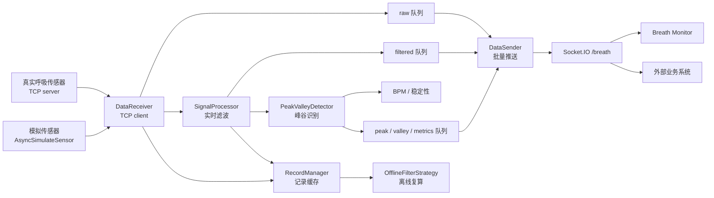
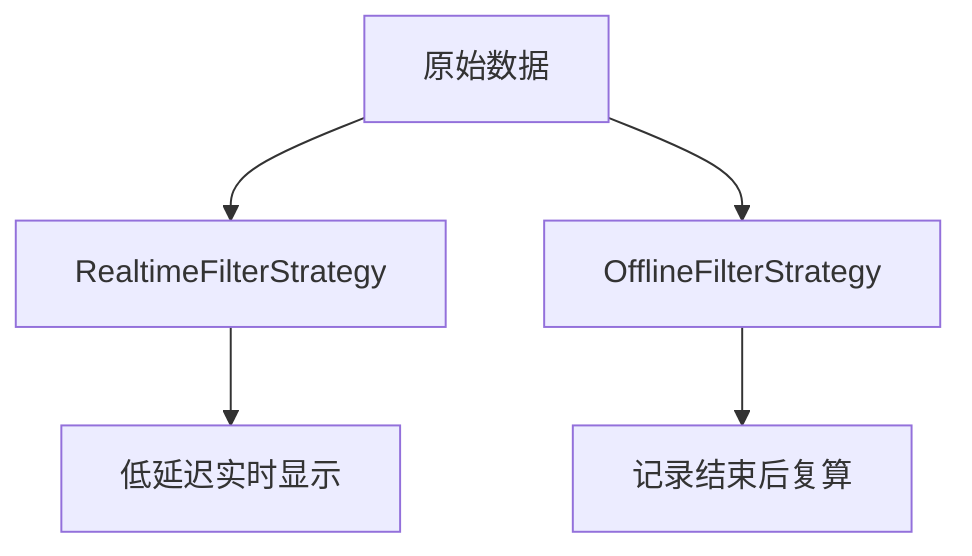

# RespiraScope 系统架构说明

本文面向希望理解项目实现方式的开发者，说明数据从传感器进入后，如何被接收、滤波、识别、记录并推送到前端。

## 总体流程



## 后端模块

| 模块 | 职责 |
| --- | --- |
| `ct_breath.config` | 读取外部 TOML 配置，不依赖环境变量 |
| `ct_breath.app` | 创建 FastAPI 与 Socket.IO 应用 |
| `ct_breath.main` | 本地和 exe 启动入口，启动后端与静态 Web Console |
| `ct_breath.frontend_static` | 启动和注入静态前端运行配置 |
| `breath_process.data_receive` | 从 TCP 传感器读取原始采样值 |
| `breath_process.signal_processor` | 执行实时滑动窗口滤波 |
| `breath_process.filter_strategies` | 区分实时滤波和离线滤波策略 |
| `breath_process.peak_valley_detector` | 检测波峰、波谷，计算 BPM 和稳定性 |
| `breath_process.record_manager` | 保存 record 区间和前后辅助点 |
| `http.http_service` | 暴露启动接收、状态、记录、离线滤波等 HTTP 接口 |
| `socket_io_service` | 维护 Socket.IO 命名空间和实时推送 |

## 实时与离线滤波

实时滤波使用因果滤波，目标是低延迟。它适合实时显示，但峰谷位置可能略有滞后。

离线滤波用于 Record End 后的复盘分析，可以使用更完整的上下文和双向滤波，目标是更平滑、更准确的结果。



## 前端入口

生产和开发环境都只启动一个 Web Console：

```text
http://localhost:5175
```

Console 中包含四个主要页面：

- Monitor：实时面向用户显示呼吸数据。
- 模拟信号设置：开发和调试模拟呼吸状态。
- Guide：基础配置和操作说明。
- API Docs：外部系统集成说明。

## 配置边界

项目不依赖 `.env`。运行时配置默认从以下位置读取：

```text
Windows: D:/ct/breath-config/breath.toml
Linux:   /ct/breath-config/breath.toml
```

这种方式更适合 exe 和 Docker 部署：程序包保持不变，部署环境只替换外部配置文件。

## 端口避让

启动时会先检查 `[backend].port` 是否可用。如果端口已被占用，程序会从后续端口中寻找一个空闲端口，并使用这个端口启动后端。

前端不会直接写死配置文件里的 backend port，而是读取 `/runtime-config.js` 中的实际运行端口。因此当后端从 `8000` 自动切换到 `8001` 时，Monitor、模拟信号设置和接口文档页也会同步连接到 `8001`。
